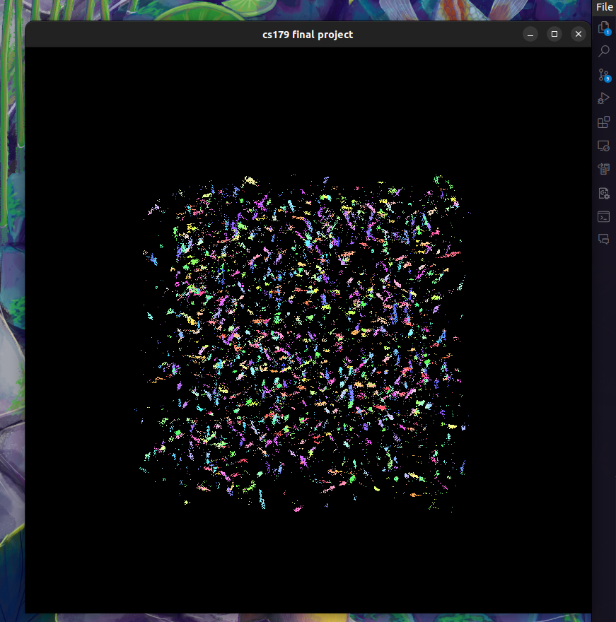
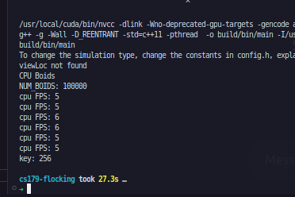
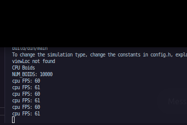
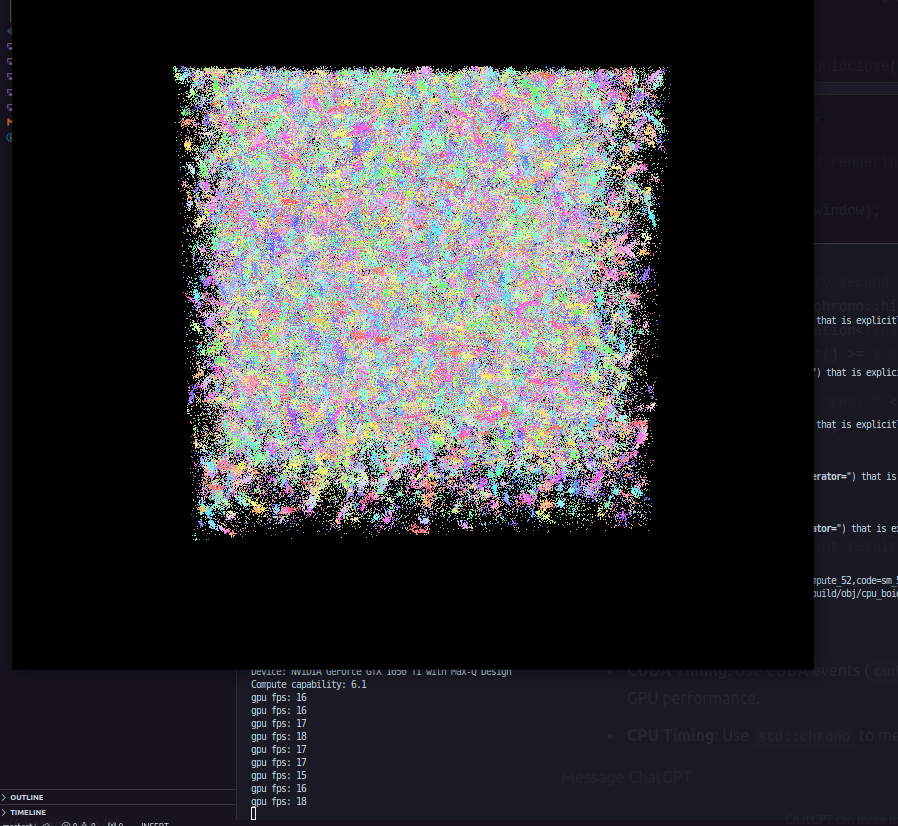
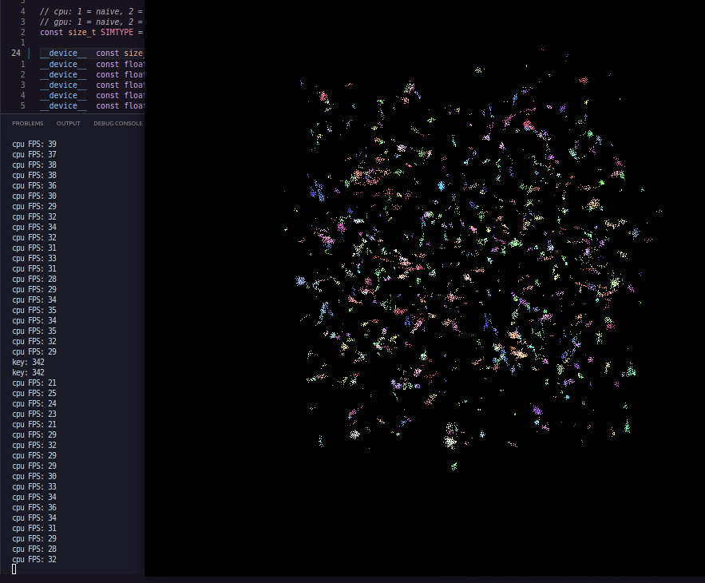

# CS179 Flocking Simulator

## Usage Instructions
<!-- code block -->
## Installation 
There's a few libraries that are needed as seen in the Makefile.

 `-lglfw -lGL -lGLU -lGLEW -lcudart`

To my knowledge, the program compiles fine. The issue is that mesa-utils is missing from `titan` which we need for a program called GLX that allows us to render an OpenGL instance remotely to our local machine.

We'll need to connect with the `-X` flag, i.e. `ssh -X <name>@titan.caltech.edu`, to let us create a window.

Install `mesa-utils` with `$ apt install mesa-utils` and test it with `$ glxgears`

Alternatively, to run locally you just need to find out how to install `libglfw3, GLEW, GLFW` on top of a regular cuda dev environment.

To run this project, run `make crun`, and  change any of the constant parameters in `config.h`. You'll want to focus on scaling factors, distances, and quantity of particles to see different behaviors. Run with `USECPU = false` and `SIMTYPE = 2` to see the fastest / best frame rate algorithm. The default `NUM_BOIDS` argument is best suited for the GPU, anything over a thousand has significant performance issues, or it did on my machine. 

## Project Description
What does the program do?
1. Visualize lifelike flocking behavior of a massive >1m amount of particles in 3 dimensions
				- Based on 3 rules, "cohesion", "alignment", and separation, each with their own radius and scale factor
               - 2 algorithm implementations on CPU and GPU (4 total, technically 5)
                --- 1. naive approach, O(n^2) on CPU, comparing each particle
                --- 2. "flattened grid" approach, closer to O(nlogn) on CPU, only comparing particles in similar spatial distance, "buckets"
                    - technically there's another implementation which generates a hash of the coordinate particles to compare ones that fall into the same bucket (modulo), but that's basically the flattened grid approach

		3. You can change the parameters in the `config.h` file  to your liking and see how the particle's behaviors changes
		4. You can use your mouse to rotate around the projected visualization of the flocking sim.
    In our original planning, we thought we'd be doing more graphics stuff but just rendering the particles as points colored by the magnitude of their velocity gets the point across.
    NOTE: all the GPU rendering was done on a laptop GTX 1050Ti.
    
## Results
What should we expect to see?

something like this:

<!-- screenshot 100k_boids.png -->

[1 million boids](https://youtu.be/Hdiz2vlfsWM)

[100k boids](https://youtu.be/BAFrjFGmaUk)

## Performance Analysis

Almost all of this simulation can be parallelized, from computing distances between each boich which influences their changes in velocity, to updating them at the same time once such a change is implemented. Hence, the use of the CUDA-OpenGL interoperability library to update Vertex Buffer Objects way faster than when the particle updating is done on a CPU.  

Just by running this program, it's clear that using a GPU to accelerate the simulation is highly effective. 

Are there things that could be improved? Yes. There's a lot of different collision algorithms that can be optimized for CUDA programming by implementing octrees and quadtrees.  Some other optimizations might be taking further advantage of CUDA's `thrust` library to get contiguous data accesses. Compute Shaders are also implemented in CUDA and can even further speed things up. That's after learning OpenGL/glsl which we had to do for this though which took up a big chunk of time anyway. 

In every case, the GPU implementation is better. Recording some fps we see

Consider 100k boids with the default paramaters, we see that on the cpu it starts at a steady 5 frames per second and for the cuda accelerated one: , there's no delay, it's 60fps

Furtheremore, we can see

For 1 million boids on the gpu:pictured here about 15 secs after starting, we see it's at a low fps, but still three times faster, around 15fps 

As context, 10k on the cpu using the grid flattening method:  hovers around half the fps of the CUDA 100k simulation, despite having 10 times less particles to match.

## Implications

Just by running this program, it's clear that using a GPU to accelerate the simulation is highly effective and clear why something like this would be useful for simulating swarms.

